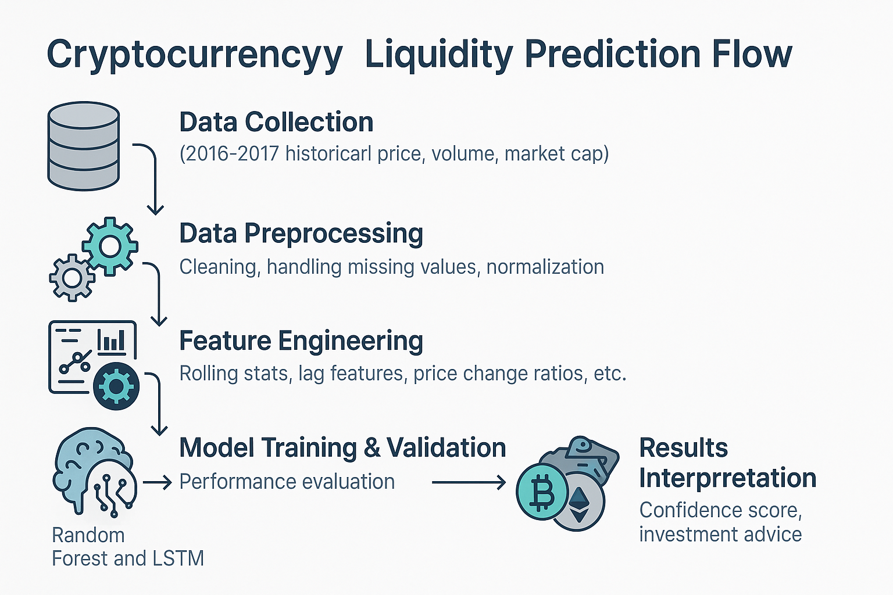

## ✅ Project: **Cryptocurrency Liquidity Predictor**  
> 🧠 Predict crypto liquidity levels using market factors like volume, price trends, listings, and social sentiment to detect early liquidity crises.

---

  

---

### 📌 Table of Contents
- [🔍 About the Project](#about-the-project)
- [🚀 Features](#features)
- [🛠️ Tech Stack](#️tech-stack)
- [📂 Project Structure](#project-structure)
- [📊 Model & Data](#model--data)
- [📦 Setup & Installation](#setup--installation)
- [🧪 Usage](#usage)
- [📄 License](#license)
- [👤 Author](#Author)

---

## 🔍 #about-the-project
In volatile crypto markets, liquidity is critical. This project uses machine learning to **predict liquidity levels** (High / Medium / Low) of cryptocurrencies based on:
- Market indicators (volume, price)
- Exchange listings
- Transaction behavior
- Social media sentiment

> 🎯 **Goal**: Detect early signs of liquidity crises to help traders and platforms manage risks effectively.

---

## 🚀 #features
- 🔎 Real-time cryptocurrency liquidity prediction
- 📈 Trained on historical crypto market data
- 🤖 Ensemble of LSTM, Random Forest Regressor, and Decision Tree Regressor used as meta-models for regression
- 📊 Interactive dashboard (optional)
- 🧪 Confidence score with actionable trading suggestions

---

### 🛠️ #tech-stack
| Tech | Use |
|------|-----|
| Python | ML modeling, data processing |
| Flask / FastAPI | Backend prediction API |
| Scikit-learn / PyTorch | ML / LSTM models |
| Pandas / NumPy | Data preprocessing |
| Matplotlib / Seaborn | Visualization |
| Bootstrap / HTML | Frontend UI |
| Git | Version control |

---

### 📂 	#project-structure

crypto-liquidity-predictor/
│
├── documents/             # Historical cryptocurrency market and sentiment datasets
├── notebook/              # Jupyter notebooks for EDA, feature engineering, and model training
├── templates/             # HTML templates for the web frontend (Flask)
├── .gitignore             # Specifies files and folders to ignore in version control
├── .render/               # Configuration for deployment on Render.com
├── app.py                 # Main Flask application to serve predictions
├── README.md              # Project overview, setup instructions, and usage guide
└── requirements.txt       # Python dependencies required to run the project

### 📊 #model--data

* The model predicts cryptocurrency liquidity levels using key market features:

* Input Features: Trading volume, price lag, rolling stats, volume-to-market cap ratio, social media sentiment, and exchange listing indicators.

* Target Variable:Liquidity level (e.g., low, medium, high), derived from volume and Amihud ratio.

* Models Used:
    - RandomForestRegressor
    - DecisionTreeRegressor
    - LSTM (Long Short-Term Memory)
    - Combined using meta-regressor for improved accuracy

### 📦 #setup--installation

Requirements:

* Python 3.9.10
* Flask, sklearn, PyTorch, Pandas, Numpy, Matplotlib, statsmodels etc.

# Clone the repository
`git clone https://github.com/yourusername/crypto-liquidity-predictor.git`
`cd crypto-liquidity-predictor`

# Create a virtual environment
`python -m venv venv`
`source venv/bin/activate  # For Windows: venv\Scripts\activate`

# Install dependencies
`pip install -r requirements.txt`

# Run the web app
`python app.py`

### 🧪 #usage

* Launch the Flask app.
* Enter feature inputs like recent price, volume, social score, etc.
* Click Predict Liquidity.
* View predicted liquidity level with a confidence score and trading suggestion.

### 📄 	#license

This project is released under the MIT License, a permissive open-source license.
You are free to use, modify, and distribute this code for personal or commercial purposes without restrictions.
Please include the original copyright and license notice in any copies or substantial portions of the software.

### 👤 #author
Somes Dash
[GitHub Profile](https://github.com/SD-95)
[Gmail](somes.dash1995@gmail.com)"# Cryptocurrency-Liquidity-Predictior" 
